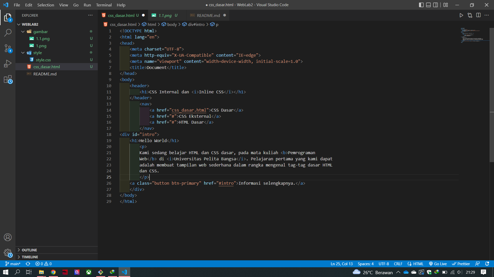
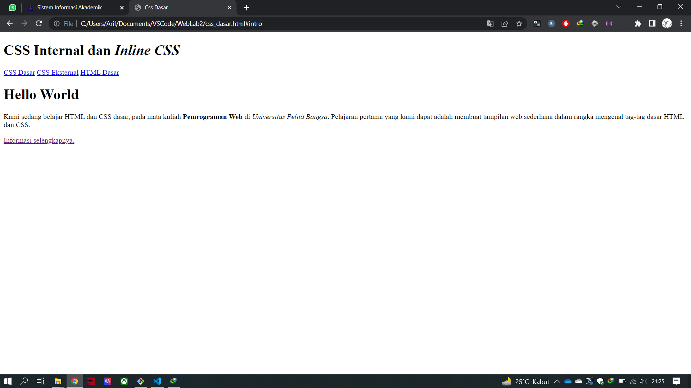
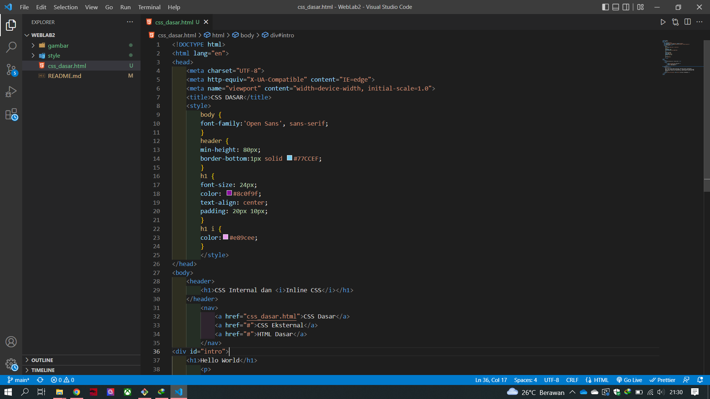
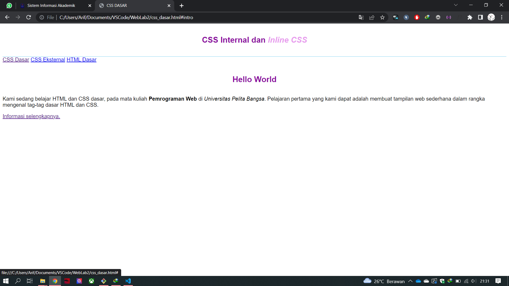
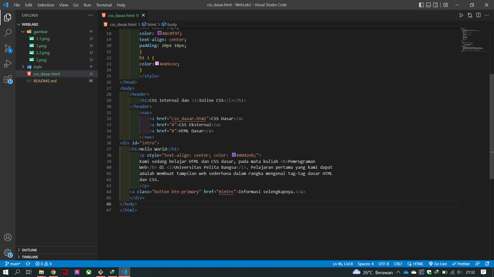
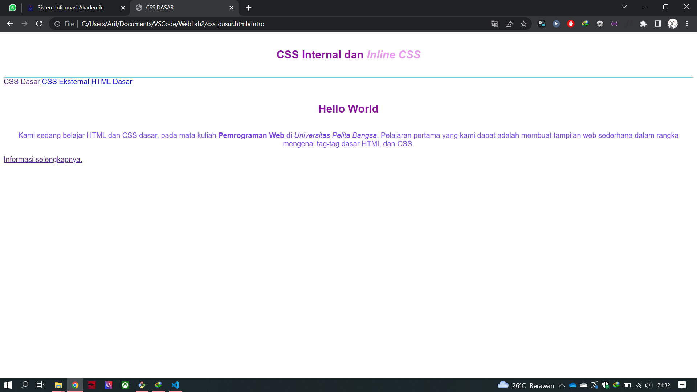
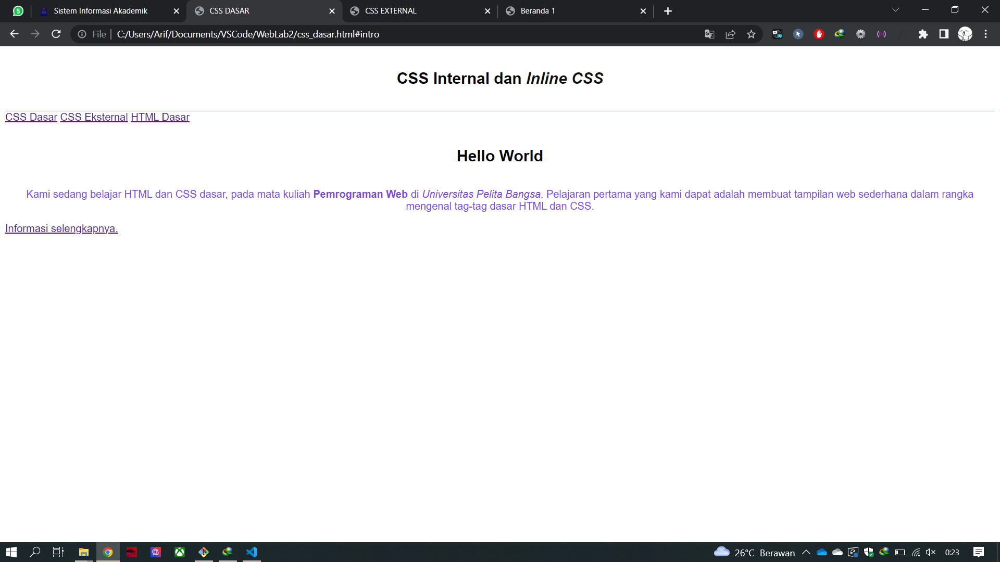
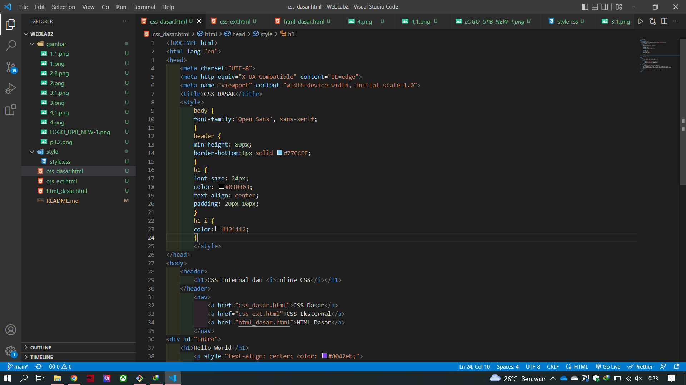
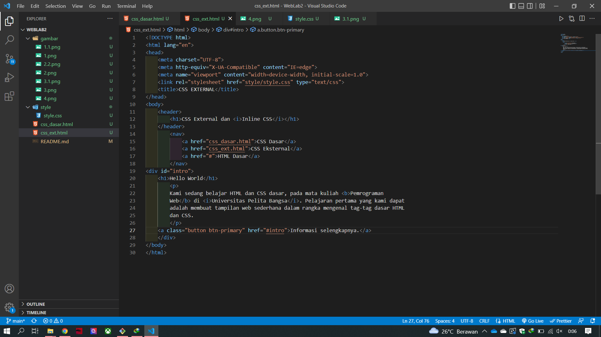
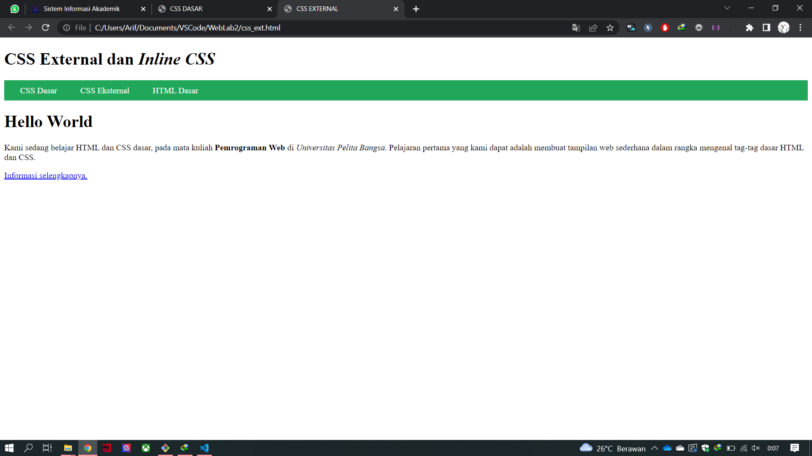

# WebLab2
## CSS Dasar

### Membuat struktur HTML, Nav Bar, Konten
Membuat Struktur HTML seperti dibawah ini

dan hasil selanjutnya yang akan ditampilkan seperti ini

### Menambahkan Style CSS langsung pada kode html
menggukanan CSS langsung pada bagian baris kode `<head>`dan
memanggil fungsi `<style>` seperti gambar dibawah

dan hasil css yang akan di tampilkan seperti gambar di bawah

### Mengatur style langusng di dalam tag
mengatur langsung style pada baris kode seperti gambar dibawah

dan akan yang ditampilkan

perubahan yang di kostumisasi ulang

### Membuat CSS external
menggunakan metode ini bisa sangat efektif dikarenakan cukup memanggil file css dari baris kode html
yang fungsinya untuk memper pendek baris kode pada HTML dan terlihat penyusunan repo yang lebih rapih
seperti gambar dibawah

dan yang akan ditampilkan seperti dibawah
